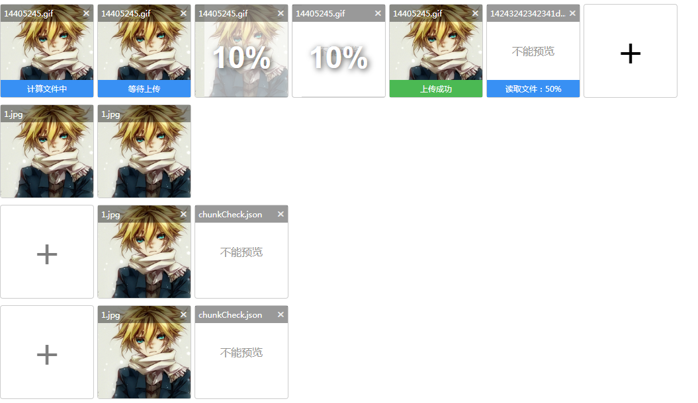

# EasyWebUploader



## 使用说明
### 上传
html页面
```
<input type="file" name="pics" id="test2"  value="{ url:'mock/1.jpg',value:1 },{ url:'mock/1.jpg',value:2 }" />
```

js实例化
```
var w2 = new EasyWebUploader({
    'elem':"#test2",
    server:"mock/upload.json",
    md5Server:"mock/md5.json",
    fileNumLimit:3,
    chunked: true, //开启分块上传
    chunkSize: 1024,
    chunkCheckServer:"mock/chunkCheck.json",
    chunksMergeServer:"mock/merge.json",//分片合并
    'success':function (obj,file,res) {

    },
    'error' : function () {

    },
    'complete':function () {

    }
}).create();
```

### 仅显示

html页面
```
<input type="file" name="pics" id="test2"  value="{ url:'mock/1.jpg',value:1 },{ url:'mock/chunkCheck.json',value:2 }" />
```

js实例化
```
var w2 = new EasyWebUploader({
    'elem':"#test2"
}).show();
```


## 参数说明

html元素的参数
|参数名|说明|
|id|必须|
|name|表单提交时用的存值的键名|
|value|表单提交时默认值 数组对象 { url:'mock/1.jpg',value:1 },{ url:'mock/1.jpg',value:2 }|

EasyWebUploader参数的说明

|参数名|说明|
|---|---|
|elem|用来查找的字符串|
|server|上传地址，同webuploader|
|md5Server|秒传md5值检验地址，如果不填则无法秒传|
|fileNumLimit|数量限制，同webuploader|
|chunked|开启分块上传，同webuploader|
|chunkSize|每块大小，同webuploader|
|chunkCheckServer|断点续传，地址，如果不填则不支持断点续传|
|chunksMergeServer|分片合并地址，如果不填则无法完成合并|
